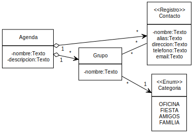
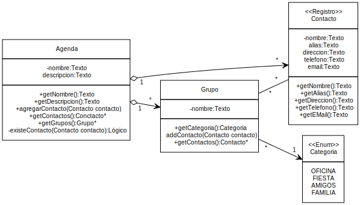

<h1 style="color: gray">Programación Orientada a Objetos</h1>

<h5 style="color: gray">Área de programación 
Programa de Ingeniería de Sistemas y Computación 
Facultad de Ingeniería
</h5>

<b>
Problema:  
Información de un estudiante 
</b>

---

El director del programa le ha solicitado al profesor Robinson reportes con las notas de los estudiantes. Para ello, el profesor necesita que la aplicación permita:

- Configurar un listado de notas parciales (nombre de la nota y su porcentaje) para el curso.
- Validar antes de registrar y consultar las notas en el curso, que el porcentaje de todas las notas parciales sea igual al 100%.
- Registrar y modificar las notas de los estudiantes indicando el nombre de la nota, el número de identificación del estudiante y su respectivo valor de la nota.
- Obtener el o los estudiantes que han obtenido la mayor nota definitiva del curso. 
- Obtener el listado (alfabéticamente ordenado) de los estudiantes que perdieron.

---

- Del problema anterior con el profesor Robinson
  - Almacenar/Recuperar la información de varios estudiante. 
  - Agregar/Recuperar un estudiante al curso
  - Obtener el listado de los estudiantes en orden alfabético
  - Obtener el listado de los estudiantes en orden descendente según la edad
  - Obtener el listado de los estudiantes menores de edad

---

- De este nuevo problema
  - Almacenar/Recuperar (configurar) el listado de las notas parciales.
    - Cada nota parcial tiene nombre de la nota y su porcentaje
  -  Validar que el porcentaje de todas las notas parciales sea igual al 100%.
  - Registrar y modificar las notas de los estudiantes.
  - Obtener el o los estudiantes que han obtenido la mayor nota definitiva del curso. 
  - Obtener el listado (alfabéticamente ordenado) de los estudiantes que perdieron. 

---

- del curso
  - nombre: Texto
  - lista de estudiantes del curso : Colección de estudiantes
  - lista de las notas parciales

- de la nota parcial
  - nombre de la nota
  - porcentaje 
---

- por cada estudiante
  - nombres : Text
  - apellidos :Texto
  - número de identificación: Texto
  - correo: Texto
  - teléfono : Texto 
  - edad: Entero
  - lista con las notas obtenidas

---

- la nota obtenida
  - la parcial en la que obtuvo la nota
  - la nota obtenida

---

---

- Estudiante
  - Almacenar/Recuperar la información del estudiante (nombres, apellidos, número de identificación, correo, teléfono, edad). 
  - Adicionar/Obtener notas obtenidas.
  - Actualizar notas obtenidas.
  - Obtener definitiva

- NotaParcial
  - Obtener el nombre
  - Obtener el porcentaje

- NotaObtenida
  - Obtener la nota parcial
  - Obtener/Actualizar la nota obtenida

---

- Curso
  - Obtener el nombre del curso
  - Agregar un estudiante al curso 
    - Validar que la identificación no exista
  - Obtener estudiante por su número de identificación
  - Obtener el listado de los estudiantes en orden alfabético
  - Obtener el listado de los estudiantes en orden descendente según la edad
  - Obtener el listado de los estudiantes menores de edad
  - Adicionar notas parciales y Obtener una nota parcial específica
  - Obtener el listado de los estudiantes con mayor nota
  - Obtener el listado alfabético de los estudiantes que perdieron
  - Validar porcentajes de las notas

---

---

Clase: **Estudiante**

| Prueba                                | Entrada de datos                                          | Salida (Resultado)                                                                                  |
|---------------------------------------|-----------------------------------------------------------|-----------------------------------------------------------------------------------------------------|
| Datos Completos | Estudiante(“Camila", "Alzate Rios”, ”109453264”, “camila@uniquindio.edu.co”, “315635674”, 18)| Estudiante creado Estudiante(“Camila", "Alzate Rios”,”109453264”, “camila@uniquindio.edu.co”, “315635674”, 18) |
| Con datos nulos | Estudiante(null,null,null,null,null,0) | Error, faltan datos para la creación del estudiante |
| Datos vacíos | Estudiante(“”, “”, “camila@uniquindio.edi.co”, “”, 18)| Error, faltan datos para la creación del estudiante |
| Edad negativa | Estudiante(“Camila, Alzate Rios”, “109453264”, “camila@uniquindio.edu.co”, “315635674”, -18) |Error, la edad no pueden ser negativos                      |
| Correo inválido | Estudiante(“Camila, Alzate Rios”, “109453264”, “cami”, “315635674”, 18)  | Error, el correo del estudiante es invalido         |

Pruebas a asociadas a las clase **Estudiante** que se está reutilizando del Problema 01.

---

Clase: **Curso**

| Prueba                                | Entrada de datos                                          | Salida (Resultado)                                                                                  |
|---------------------------------------|-----------------------------------------------------------|-----------------------------------------------------------------------------------------------------|
| Datos Completos | Curso("Programación 1")| Curso creado Curso("Programación 1") |
| Agregar un estudiante | registrarEstudiante( Estudiante(“Camila", "Alzate Rios”,”109453264”, “camila@uniquindio.edu.co”, “315635674”, 18) )| Estudiante registrado Estudiante(“Camila", "Alzate Rios”,”109453264”, “camila@uniquindio.edu.co”, “315635674”, 18)|
| Agregar un estudiante nulo | registrarEstudiante( null )| Error, no puede agregar un estudiante nulo.|
| Agregar un estudiante repetido | registrarEstudiante( Estudiante(“Camila", "Alzate Rios”,”109453264”, “camila@uniquindio.edu.co”, “315635674”, 18) )   registrarEstudiante( Estudiante(Rodrigo", "Calderon”,”109453264”, “rodrigo@uniquindio.edu.co”, “3223451278”, 19) )| Error, no puede registrar dos veces el mismo número de identificación |

Pruebas a asociadas a las clase **Curso** que se está reutilizando del Problema 02.

---

Clase: **Curso**

| Prueba                                | Entrada de datos                                          | Salida (Resultado)                                                                                  |
|---------------------------------------|-----------------------------------------------------------|-----------------------------------------------------------------------------------------------------|
| Obtener listado alfabético | registrarEstudiante( Estudiante(“Camila", "Alzate Rios”,”109453264”, “camila@uniquindio.edu.co”, “315635674”, 15) )   registrarEstudiante( Estudiante(“Xiomara", "Gomez”,”109445634”, “xiomara@uniquindio.edu.co”, “3148763412”, 31) )   registrarEstudiante( Estudiante(“Ana Maria", "Quintero”,”109498764”, “anamaria@uniquindio.edu.co”, “3137442312”, 28) )   registrarEstudiante( Estudiante(“Yudi", "Pulgarin”,”1092394924”, “yudi@uniquindio.edu.co”, “3218341234”, 17) )| Se obtiene el listado de los estudiantes en el orden: "Ana Maria", "Camila", "Xiomara", "Yudi" |
| Obtener listado edad descendete | registrarEstudiante( Estudiante(“Camila", "Alzate Rios”,”109453264”, “camila@uniquindio.edu.co”, “315635674”, 15) )   registrarEstudiante( Estudiante(“Xiomara", "Gomez”,”109445634”, “xiomara@uniquindio.edu.co”, “3148763412”, 31) )   registrarEstudiante( Estudiante(“Ana Maria", "Quintero”,”109498764”, “anamaria@uniquindio.edu.co”, “3137442312”, 28) )   registrarEstudiante( Estudiante(“Yudi", "Pulgarin”,”1092394924”, “yudi@uniquindio.edu.co”, “3218341234”, 17) )| Se obtiene el listado de los estudiantes en el orden: "Xiomara", "Ana Maria", "Yudi", "Camila" |

Pruebas a asociadas a las clase **Curso** que se está reutilizando del Problema 02.

---

Clase: **Curso**

| Prueba                                | Entrada de datos                                          | Salida (Resultado)                                                                                  |
|---------------------------------------|-----------------------------------------------------------|-----------------------------------------------------------------------------------------------------|
| Obtener listado menores de edad | registrarEstudiante( Estudiante(“Camila", "Alzate Rios”,”109453264”, “camila@uniquindio.edu.co”, “315635674”, 15) )   registrarEstudiante( Estudiante(“Xiomara", "Gomez”,”109445634”, “xiomara@uniquindio.edu.co”, “3148763412”, 31) )   registrarEstudiante( Estudiante(“Ana Maria", "Quintero”,”109498764”, “anamaria@uniquindio.edu.co”, “3137442312”, 28) )   registrarEstudiante( Estudiante(“Yudi", "Pulgarin”,”1092394924”, “yudi@uniquindio.edu.co”, “3218341234”, 17) )| Se obtiene el listado de los estudiantes en el orden:  "Camila", "Yudi" |

Pruebas a asociadas a las clase **Curso** que se está reutilizando del Problema 02.

---

Clase: **NotaParcial** 

| Prueba                                | Entrada de datos                                          | Salida (Resultado)                                                                                  |
|---------------------------------------|-----------------------------------------------------------|-----------------------------------------------------------------------------------------------------|
| Obtener datos completos | NotaParcial("Parcial 1", 0.20) | Nota parcial creada NotaParcial("Parcial 1", 0.20)  |
| Nombre nulo | NotaParcial(null, 0.20)  | Error no se pueden crear una nota parcial con nombre nulo |
| Nombre vacío | NotaParcial("", 0.20)  | Error no se pueden crear una nota parcial con nombre vació |
| Porcentaje menor que 0.0 (0%) | NotaParcial("Parcial 1", -0.20)  | Error no se pueden crear una nota parcial con un porcentaje negativo |
| Porcentaje mayor que 1.0 (100%) | NotaParcial("Parcial 1", 3.20)  | Error no se pueden crear una nota parcial con un porcentaje superior a 1.0 (100%) |

---

Clase: **NotaObtenida** 

| Prueba                                | Entrada de datos                                          | Salida (Resultado)                                                                                  |
|---------------------------------------|-----------------------------------------------------------|-----------------------------------------------------------------------------------------------------|
| Obtener datos completos | NotaObtenida( NotaParcial("Parcial 1", 0.20), 3.5), asumiendo que la nota parcial existe | Se crea correctamente la nota obtenida  NotaObtenida( NotaParcial("Parcial 1", 0.20), 3.5) |
| Nota parcial null | NotaObtenida(null, 3.5) | Error no se puede crear una nota obtenida si el nombre de la nota parcial es null|
| Nota obtenida menor que 0.0 | notaObtenida( NotaParcial("Parcial 1", 0.20), -2.5), asumiendo que la nota parcial existe | Error no se puede crear una nota obtenida con un valor negativo |
| Nota obtenida mayor que 5.0 | notaObtenida( NotaParcial("Parcial 1", 0.20), 7.8), asumiendo que la nota parcial existe | Error no se puede crear una nota obtenida con un valor superior a 5.0 |

---

Clase: **Estudiante** (nuevas funcionalidades)

| Prueba                                | Entrada de datos                                          | Salida (Resultado)                                                                                  |
|---------------------------------------|-----------------------------------------------------------|-----------------------------------------------------------------------------------------------------|
| Obtener una nota obtenida existente | Al Estudiante(“Camila", "Alzate Rios”,”109453264”, “camila@uniquindio.edu.co”, “315635674”, 15) se le pide obtener la nota obtenida del "Parcial 1", asumiendo que existe NotaObtenida( NotaParcial("Parcial 1", 0.20), 3.5)  | Se obtiene NotaObtenida( NotaParcial("Parcial 1", 0.20), 3.5) |
|Registrar más de una nota a una nota parcial| Al Estudiante(“Camila", "Alzate Rios”,”109453264”, “camila@uniquindio.edu.co”, “315635674”, 15) se intenta registra dos veces NotaObtenida( NotaParcial("Parcial 1", 0.20), 3.5) |Error, no se pueden adicionar varias notas a una misma nota parcial. |
| Obtener una nota obtenida inexistente | Al Estudiante(“Camila", "Alzate Rios”,”109453264”, “camila@uniquindio.edu.co”, “315635674”, 15) se le pide obtener la nota obtenida del "Parcial 2", asumiendo que NO existe la nota parcial llamada "Parcial 2" | Error, no se puede adicionar una nota obtenida a una nota parcial inexistente.  |
| Actualizar una nota parcial existente | Al Estudiante(“Camila", "Alzate Rios”,”109453264”, “camila@uniquindio.edu.co”, “315635674”, 15) se pide actualizar nota obtenida "Parcial 1" a la nota 4.3, asumiendo que existe NotaObtenida( NotaParcial("Parcial 1", 0.20), 3.5)| Se actualiza correctamente la nota obtenida correctamente. |
| Actualizar una nota parcial inexistente |Al Estudiante(“Camila", "Alzate Rios”,”109453264”, “camila@uniquindio.edu.co”, “315635674”, 15) se pide actualizar nota obtenida "Parcial 2" a la nota 2.5, asumiendo que no exista la nota parcial "Parcial 2"| Error, no se puede actualizar una nota obtenida si no existe la nota parcial| 

---

Clase: **Estudiante** (nuevas funcionalidades)

| Prueba                                | Entrada de datos                                          | Salida (Resultado)                                                                                  |
|---------------------------------------|-----------------------------------------------------------|-----------------------------------------------------------------------------------------------------|
| Actualizar una nota parcial existente mayor que 5.0 | Al Estudiante(“Camila", "Alzate Rios”,”109453264”, “camila@uniquindio.edu.co”, “315635674”, 15) se le registran una nota obtenida NotaObtenida( "Parcial 1", 3.5), asumiendo que existe NotaParcial("Parcial 1", 0.20) y se actualiza la nota "Parcial 1" a 9.2| Error, no se puede actualizar una nota por un valor superior a 5.0 |
| Actualizar una nota parcial existente menor que 0.0 | Al Estudiante(“Camila", "Alzate Rios”,”109453264”, “camila@uniquindio.edu.co”, “315635674”, 15) se le registran una nota obtenida NotaObtenida( "Parcial 1", 3.5), asumiendo que existe NotaParcial("Parcial 1", 0.20) y se actualiza la nota "Parcial 1" a -2.1| Error, no se puede actualizar una nota por un valor menor a 0.0 |
| Se obtiene la nota definitiva de un estudiante que tiene varias notas | Al Estudiante(“Camila", "Alzate Rios”,”109453264”, “camila@uniquindio.edu.co”, “315635674”, 15) se le registran las notas de 3.2, 4.2 y 4.0 en las notas parciales NotaParcial("Parcial 1", 0.20), NotaParcial("Parcial 2", 0.30), NotaParcial("Parcial 3", 0.50), respectivamente.  | Se obtiene una nota definitiva de 3.9 |
| Se obtiene la nota definitiva de un estudiante que NO tiene notas | Al Estudiante(“Camila", "Alzate Rios”,”109453264”, “camila@uniquindio.edu.co”, “315635674”, 15) NO se le registran notas | Error, debe tener notas parciales cuyo peso sume 1.0 (100%) |
| Se obtiene la nota definitiva cuando las notas parciales NO suman 1.0 (100%) | Al Estudiante(“Camila", "Alzate Rios”,”109453264”, “camila@uniquindio.edu.co”, “315635674”, 15) se le registran notas en sus notas parciales (cualquiera) | Error, el porcentaje de las notas parciales no suman 1.0 (100%) |
---

Clase: **Curso** (nuevas funcionalidades)

| Prueba                                | Entrada de datos                                          | Salida (Resultado)                                                                                  |
|---------------------------------------|-----------------------------------------------------------|-----------------------------------------------------------------------------------------------------|
| Obtener una nota parcial existente | Curso("Programación 1") se le registra la nota parcial NotaParcial("Parcial 3", 0.50) y se busca por el nombre "Parcial 3" | Se obtiene la nota parcial NotaParcial("Parcial 3", 0.50) |
| Obtener una nota parcial inexistente | Curso("Programación 1") se le registra únicamente la nota parcial NotaParcial("Parcial 3", 0.50) y se busca por el nombre "Parcial 1", asumiendo que esta nota parcial NO existe | Error, la nota parcial no existe |
| Obtener listado estudiante mayor nota | Al Curso("Programación 1") se le registran 4 notas parciales llamadas "Parcial 1", "Parcial 2", Parcial 3" y "Parcial 4"; con los porcentajes 10%, 20%, 30%, 40%; Se registran cinco estudiantes de nombres "Xiomara", "Ana", "Jorge", "David", "Catalina"; cada uno con las siguientes cinco notas ( (2.0, 1.3, 4.8, 4.5), (4.5, 3.2, 2.5, 4.5), (1.4, 2.2, 3.1, 1.9), (4.8, 4.0, 3.1, 3.8), (2.3, 3.1, 1.9, 3.1) ) | Las notas definitivas son (3.7, 3.6, 2.3, 3.7, 2.7) así que los estudiantes con mayor nota son "Xiomara", "David" |
| Obtener listado alfabético estudiante que perdieron | Al Curso("Programación 1") se le registran 4 notas parciales llamadas "Parcial 1", "Parcial 2", Parcial 3" y "Parcial 4"; con los porcentajes 10%, 20%, 30%, 40%; Se registran cinco estudiantes de nombres "Xiomara", "Ana", "Jorge", "David", "Catalina"; cada uno con las siguientes cinco notas ( (2.0, 1.3, 4.8, 4.5), (4.5, 3.2, 2.5, 4.5), (1.4, 2.2, 3.1, 1.9), (4.8, 4.0, 3.1, 3.8), (2.3, 3.1, 1.9, 3.1) ) | Las notas definitivas son (3.7, 3.6, 2.3, 3.7, 2.7) así que los estudiantes que perdieron en orden alfabético son "Catalina" y "Jorge"|

---

Clase: **Curso** (nuevas funcionalidades)

| Prueba                                | Entrada de datos                                          | Salida (Resultado)                                                                                  |
|---------------------------------------|-----------------------------------------------------------|-----------------------------------------------------------------------------------------------------|
| Validar porcentaje igual a 100.0 |  Al Curso("Programación 1") se le registran 4 notas parciales llamadas "Parcial 1", "Parcial 2", Parcial 3" y "Parcial 4"; con los porcentajes 10%, 20%, 30%, 40% | El resultado es **Verdadero** ya que la suma de los porcentajes da 1.0 (100%)  |
| Validar porcentaje diferente de 100.0 | Al Curso("Programación 1") se le registran 4 notas parciales llamadas "Parcial 1", "Parcial 2", Parcial 3" y "Parcial 4"; con los porcentajes 30%, 20%, 1%, 40% | El resultado es **Falso** ya que la suma de los porcentajes da 0.9 (90%) que es diferente a 1.0 (100%) |

---

- La clase **Estudiante** del Problema 01 con sus respectivas pruebas.
  - Adicionando nuevas funcionalidades con las nuevas pruebas.

- La clase **Curso** del Problema 02 con sus respectivas pruebas.
  - Adicionando nuevas funcionalidades con las nuevas pruebas.

---

- **¿Cómo pruebo la solución?**

  - Almacenar datos de prueba de un estudiante. 
  - Recuperar datos de prueba de un estudiante. 
  - Verificar que los datos almacenados coinciden con los datos recuperados

- **Cómo escribo la solución en Java?**

  Ver la carpeta del *src* en el proyecto de **Visual Studio Code**

---

<!-- 
_header: ''
_footer: '' 
_paginate: false
_backgroundImage: url('imagenes/gracias.png')
-->
