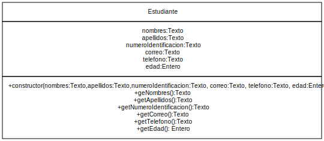

<h1 style="color: gray">Programación Orientada a Objetos</h1>

<h5 style="color: gray">Área de programación 
Programa de Ingeniería de Sistemas y Computación 
Facultad de Ingeniería
</h5>

<b>
Problema:  
Información de un estudiante 
</b>

---

Luis es un profesor de la universidad del Quindío que le ha solicitado diseñar un sistema para la gestión de los estudiantes del curso de programación 1. Para ello, él necesita que la aplicación que permita:

Almacenar la información de un estudiante, incluyendo su número de identificación, nombres, apellidos, correo, teléfono y edad.

---

- Almacenar la información de un estudiante. 

---

- nombres : Texto
- apellidos :Texto
- número de identificación: Texto
- correo: Texto
- teléfono : Texto 
- edad: Entero

---

- Estudiante

---

- Almacenar la información de un estudiante
- Recuperar la información de un estudiante

---

- Almacenar la 
información del estudiante

---

- Recuperar la información
 de un estudiante

---

- Almacenar datos de prueba
- Recuperar los datos de prueba
- Verificar que los datos almacenados coinciden con los datos recuperados

---

| Prueba                                | Entrada de datos                                          | Salida (Resultado)                                                                                  |
|---------------------------------------|-----------------------------------------------------------|-----------------------------------------------------------------------------------------------------|
| Datos Completos | Estudiante(“Camila", "Alzate Rios”,”109453264”, “camila@uniquindio.edu.co”, “315635674”, 18)| Estudiante creado Estudiante(“Camila", "Alzate Rios”,”109453264”, “camila@uniquindio.edu.co”, “315635674”, 18) |
| Con datos nulos | Estudiante(null,null,null,null,null,0) | Error, faltan datos para la creación del estudiante |
| Datos vacíos | Estudiante(“”, “”, “camila@uniquindio.edu.co”, “”, 18)| Error, faltan datos para la creación del estudiante |
| Edad negativa | Estudiante(“Camila", "Alzate Rios”, “109453264”, “camila@uniquindio.edu.co”, “315635674”, -18) |Error, la edad no pueden ser negativos                      |
| Correo inválido | Estudiante(“Camila", "Alzate Rios”, “109453264”, “cami”, “315635674”, 18)  | Error, el correo del estudiante es invalido         |

---

- No aplica

---

- **¿Cómo pruebo la solución?**

  - Almacenar datos de prueba de un estudiante. 
  - Recuperar datos de prueba de un estudiante. 
  - Verificar que los datos almacenados coinciden con los datos recuperados

- **Cómo escribo la solución en Java?**

  Ver la carpeta del *src* en el proyecto de **Visual Studio Code**

---

<!-- 
_header: ''
_footer: '' 
_paginate: false
_backgroundImage: url('imagenes/gracias.png')
-->
